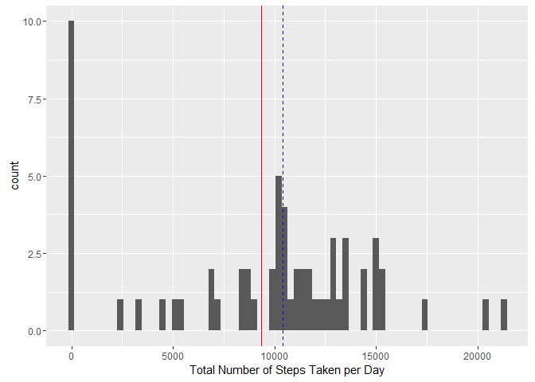
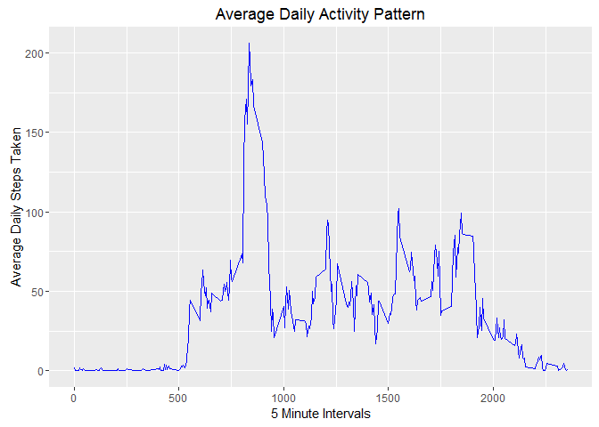
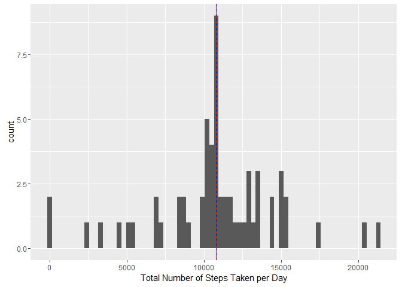
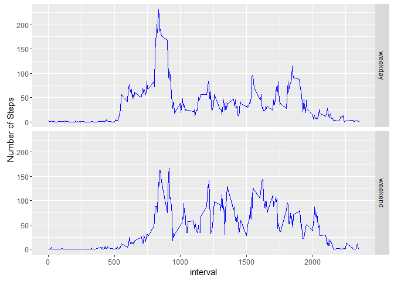

# Reproducible Research: Peer Assessment 1

## Preamble

This assignment makes use of data from a personal activity monitoring device. This device collects data at 5 minute intervals through out the day. The data consists of two months of data from an anonymous individual collected during the months of October and November, 2012 and include the number of steps taken in 5 minute intervals each day.


## Loading and preprocessing the data
Data is contained in a comma separated file with header so use read.csv

```r
activity <- read.csv("activity.csv", header=TRUE)
```

Calculate the total number of steps taken each day

```r
stepsPerDay <- aggregate(activity$steps, by=list(activity$date), sum, na.rm=TRUE)
```

Give the data better names

```r
names(stepsPerDay) <- c("Date", "totalSteps")
```

## Histogram of the total number of steps taken each day

```r
library(ggplot2)
```

```
## Warning: package 'ggplot2' was built under R version 3.2.4
```

```r
qplot(totalSteps,
  data=stepsPerDay,
  geom="histogram",
  xlab="Total Number of Steps Taken per Day",
  binwidth=300) +
  geom_vline(aes(xintercept=mean(stepsPerDay$totalSteps)), colour="red") +
  geom_vline(aes(xintercept=median(stepsPerDay$totalSteps)), colour="blue", linetype="dashed")
```



## What is mean total number of steps taken per day?

Calculate and report the mean and median of the total number of steps taken per day

```r
mean(stepsPerDay$totalSteps)
```

```
## [1] 9354.23
```

```r
median(stepsPerDay$totalSteps)
```

```
## [1] 10395
```

## What is the average daily activity pattern?

Calculate the average number (mean) of steps taken each interval

```r
stepsPerInterval <- aggregate(activity$steps, by=list(activity$interval), mean, na.rm=TRUE)
```

Store all the interval values as numeric

```r
intervals<-as.numeric(unique(activity$interval))
```

Create the time series plot

```r
graph <- ggplot(
    stepsPerInterval,
    aes(intervals, stepsPerInterval[[2]]),
)
graph + 
    geom_line(colour="blue") + 
    ggtitle("Average Daily Activity Pattern") +
    xlab("5 Minute Intervals") +
    ylab("Average Daily Steps Taken")
```



## Which 5-minute interval, on average across all the days in the dataset, contains the maximum number of steps?


```r
max_int <- which.max(stepsPerInterval[[2]])
stepsPerInterval[max_int,]$Group.1
```

```
## [1] 835
```

The interval with the maximum number of steps is 835

## Imputing missing values

### Calculate and report the total number of missing values in the dataset (i.e. the total number of rows with NAs)


```r
sum(is.na(activity))
```

```
## [1] 2304
```

Create a "missing value" copy of the original data

```r
activityMV <- activity
```

Assign all missing values with the mean for that 5 minute interval

```r
activityMV$steps[is.na(activityMV$steps)] <- tapply(activityMV$steps, activityMV$interval, mean, na.rm=TRUE)
```

Calculate the total number of steps taken each day including the new values

```r
stepsPerDayMV <- aggregate(activityMV$steps, by=list(activityMV$date), sum, na.rm=TRUE)
```

Give the data better names

```r
names(stepsPerDayMV) <- c("Date", "totalSteps")
```

### Make a histogram of the total number of steps taken each day and Calculate and report the mean and median total number of steps taken per day.


```r
qplot(totalSteps,
    data=stepsPerDayMV,
    geom="histogram",
    xlab="Total Number of Steps Taken per Day",
    binwidth=300) +
    geom_vline(aes(xintercept=mean(stepsPerDayMV$totalSteps)), colour="red") +
    geom_vline(aes(xintercept=median(stepsPerDayMV$totalSteps)), colour="blue", linetype="dashed")
```




```r
mean(stepsPerDayMV$totalSteps)
```

```
## [1] 10766.19
```

```r
median(stepsPerDayMV$totalSteps)
```

```
## [1] 10766.19
```

The mean has gone up quite a bit, the median not very much, now they have the same value.

## Are there differences in activity patterns between weekdays and weekends?

Convert activity date to a properly formatted date type

```r
activityMV$date <- as.POSIXct(activityMV$date)
```

### Create a new factor variable in the dataset with two levels 'weekday' and 'weekend' indicating whether a given date is a weekday or weekend day.

```r
activityMV$week <- ifelse(weekdays(activityMV$date) %in% c("Saturday","Sunday"), "weekend", "weekday")
```

### Make a panel plot containing a time series plot (i.e. type = "l") of the 5-minute interval (x-axis) and the average number of steps taken, averaged across all weekday days or weekend days (y-axis).

Calculate the average number (mean) of steps taken during weekdays and weekends

```r
stepsPerInterval <- aggregate(activityMV$steps, by=list(activityMV$week, activityMV$interval), mean, na.rm=TRUE)
```

Give the data better names

```r
names(stepsPerInterval) = c("weekday", "interval", "mean")
```

Create the time series plot

```r
ggplot(
    stepsPerInterval,
    aes(x=interval, y=mean)) +
    geom_line(colour="blue") +
    ylab("Number of Steps") +
    facet_grid(weekday~.)
```


